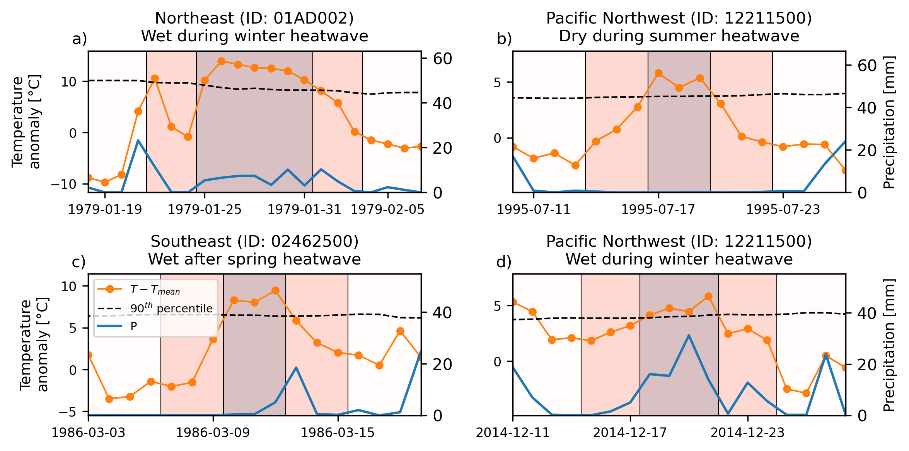
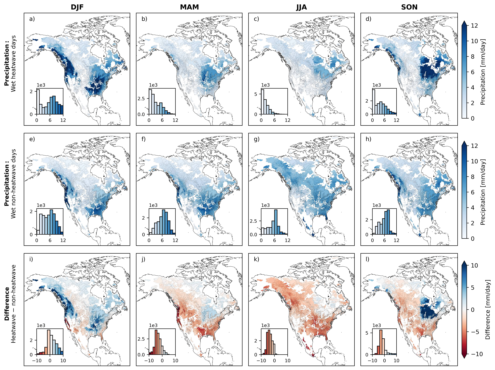

# On the precipitation characteristics of North American heatwaves

This code accompanies the paper: 

Anderson, Sam and Chartrand, Shawn. "On the precipitation characteristics of North American heatwaves." (in review) 

## Overview 

First, this code identifies periods before, during, and after heatwaves for 14,425 basins across North America. The precipitation characteristics vary strongly across different basins and seasons.

 

___ 

Then, such characteristics are summarized and analyzed in both space and time.

## Data

The study uses geographic and meteorological data from [HYSETS](https://www.nature.com/articles/s41597-020-00583-2). The data should be downloaded and structured as: 

* Data/
  * HYSETS/
    * HYSETS_watershed_properties.txt
    * HYSETS_2020_ERA5.nc
    * HYSETS_watershed_boundaries/
      * Changes.txt
      * HYSETS_watershed_boundaries_20200730.dbf
      * HYSETS_watershed_boundaries_20200730.shp
      * HYSETS_watershed_boundaries_20200730.shx
      * HYSETS_watershed_boundaries_20200730.cpg
     
## Requirements 

Dependencies:
  - cartopy=0.23.0
  - geopandas=0.14.2
  - geopandas-base=0.14.2
  - matplotlib=3.8.4
  - matplotlib-base=3.8.4
  - numpy=1.26.4
  - numpy-base=1.26.4
  - pandas=2.2.2
  - python=3.12.3
  - scikit-learn=1.5.0
  - scipy=1.11.4
  - tqdm=4.66.5
  - xarray=2024.5.0
